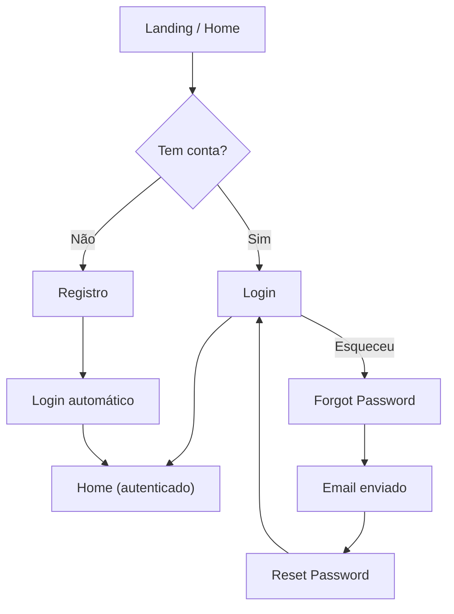
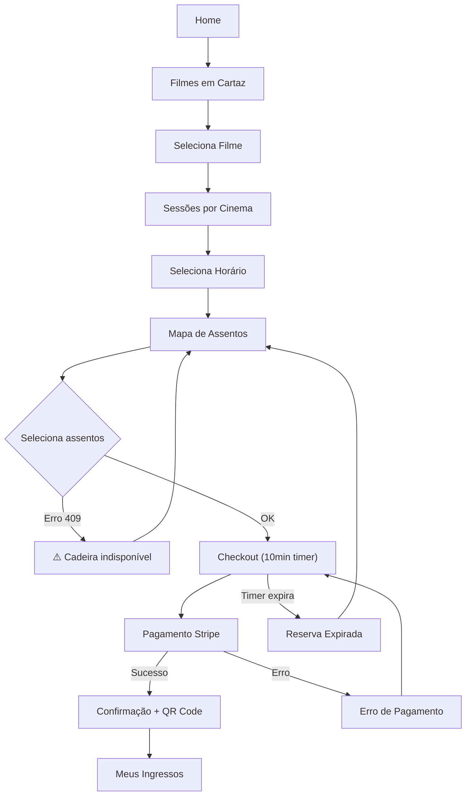
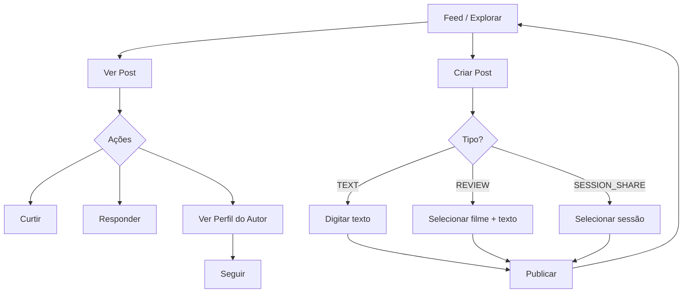
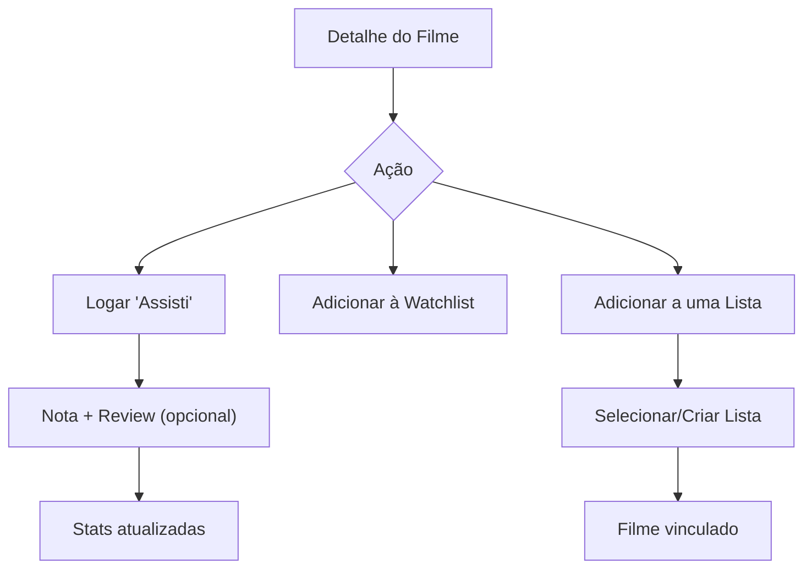
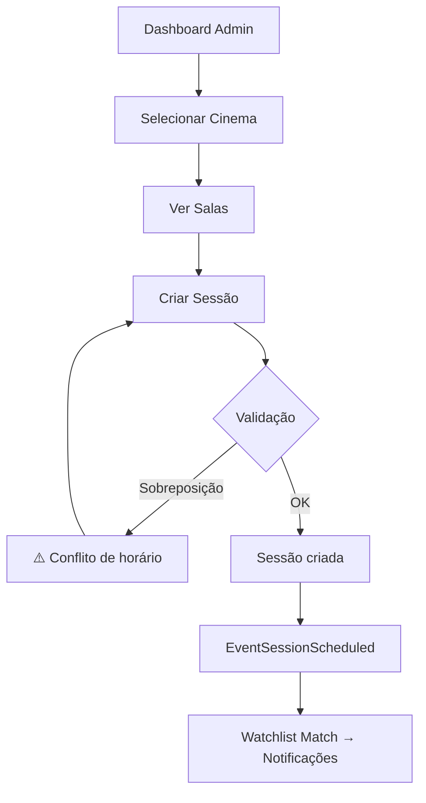

# 🎬 screeK — UI Flow Coverage Audit

Auditoria completa de telas, fluxos, estados e UX baseada no código do `backend/core`.

---

## 🧠 Etapa 1: Mapeamento de Features

---

### Feature: Autenticação (Auth)

- **Ações possíveis:**
  - Login (username + password)
  - Logout (invalida token)
  - Refresh Token
  - Esqueci minha senha (envia e-mail)
  - Resetar senha (via token de e-mail)
  - Alterar senha (autenticado, exige senha antiga)
- **Endpoints:**
  - `POST /auth/login` → `AuthTokenResponse`
  - `POST /auth/refresh` → `AuthTokenResponse`
  - `POST /auth/logout` 🔒
  - `POST /auth/forgot-password`
  - `POST /auth/reset-password`
  - `POST /auth/change-password` 🔒
- **Entidades:** User, JWT (access + refresh), Redis (blacklist)
- **Proteções:** Rate Limit (429), brute-force via `ErrTooManyAttempts`

---

### Feature: Usuários (Users)

- **Ações possíveis:**
  - Registrar conta
  - Ver perfil público (por ID)
  - Ver meu perfil (autenticado)
  - Editar perfil (name, bio, avatar_url, pronouns, default_city)
  - Deletar conta (exige confirmação de senha)
  - Buscar usuários
  - Ver estatísticas do usuário (filmes assistidos, minutos, gênero favorito)
  - Adicionar/Remover filme favorito do perfil
- **Endpoints:**
  - `POST /users/register`
  - `GET /users/search?q=`
  - `GET /users/{id}`
  - `GET /users/{id}/stats`
  - `GET /users/me` 🔒
  - `PUT /users/me` 🔒
  - `DELETE /users/me` 🔒 (body: password)
  - `POST /users/me/favorites/{tmdb_id}` 🔒
  - `DELETE /users/me/favorites/{tmdb_id}` 🔒
- **Entidades:** User, UserStats, FavoriteMovies

---

### Feature: Filmes (Movies / TMDB)

- **Ações possíveis:**
  - Buscar filmes (por título, pessoa, usuário ou lista)
  - Descobrir filmes (por gênero e/ou ano)
  - Ver detalhes do filme
  - Ver recomendações baseadas em filme
  - Ver detalhes de pessoa (ator/diretor)
  - Ver filmografia de pessoa
- **Endpoints:**
  - `GET /movies/search?q=&type=` (MOVIE|PERSON|USER|LIST)
  - `GET /movies/discover?genre_id=&year=`
  - `GET /movies/{id}`
  - `GET /movies/{id}/recommendations`
  - `GET /people/{id}`
  - `GET /people/{id}/movies`
- **Entidades:** Movie (cache TMDB), Person, Genre
- ⚠️ **Nota:** Rotas públicas (sem auth), mas o endpoint `GET /movies/{id}` do **Catalog** (com stats sociais) **requer auth**.

---

### Feature: Reservas & Ingressos (Bookings)

- **Ações possíveis:**
  - Ver filmes em cartaz (cidade + data)
  - Ver sessões de um filme (agrupadas por cinema)
  - Ver mapa de assentos de uma sessão
  - Reservar assentos (temporário, 10 min)
  - Pagar reserva (Stripe)
  - Cancelar ingresso
  - Ver meus ingressos (com filtro de status)
  - Ver detalhe de ingresso (inclui QR Code)
  - **Admin:** Ver ingressos da sessão, cancelar ingresso, cancelar sessão inteira
- **Endpoints:**
  - `GET /bookings/playing?city=&date=`
  - `GET /bookings/{id}/sessions?city=&date=`
  - `GET /bookings/sessions/{id}/seats`
  - `POST /bookings/tickets/reserve` 🔒
  - `POST /bookings/transactions/{id}/pay` 🔒 (header: Idempotency-Key)
  - `POST /bookings/tickets/{id}/cancel` 🔒
  - `GET /bookings/users/me/tickets?status=` 🔒
  - `GET /bookings/tickets/{id}` 🔒
  - `GET /bookings/admin/sessions/{id}/tickets` 🔒🛡️
  - `POST /bookings/admin/tickets/{id}/cancel` 🔒🛡️
  - `POST /bookings/admin/sessions/{id}/cancel` 🔒🛡️
  - `POST /webhooks/stripe` (externo, sem auth)
- **Entidades:** Ticket, Transaction, Session, Seat, Cinema, Room
- **Jobs:** Cleanup de reservas expiradas (`@every 1m`)

---

### Feature: Gestão Administrativa (Management)

- **Ações possíveis:**
  - CRUD de Cinemas
  - CRUD de Salas (gera assentos automaticamente)
  - CRUD de Sessões (valida sobreposição, ingressos vendidos)
  - Listar sessões por cinema e data
  - Alterar papel de usuário (Admin only)
- **Endpoints (todas 🔒🛡️ Admin/Manager):**
  - `GET/POST /admin/management/cinemas`
  - `GET/PUT/DELETE /admin/management/cinemas/{id}`
  - `POST /admin/management/cinemas/{id}/rooms`
  - `PUT/DELETE /admin/management/rooms/{id}`
  - `GET/POST /admin/management/sessions`
  - `PUT/DELETE /admin/management/sessions/{id}`
  - `PATCH /admin/users/{id}/role` 🔒🛡️ (Admin only)
- **Entidades:** Cinema, Room, Seat, Session
- **Eventos:** `EventSessionScheduled` → dispara match de watchlist

---

### Feature: Catálogo Social (Catalog)

- **Ações possíveis:**
  - Registrar que assistiu um filme (log com nota e review)
  - CRUD Watchlist (lista de desejos)
  - CRUD Listas personalizadas (ex: "Favoritos de Terror")
  - Adicionar/Remover filmes de listas
  - Ver detalhe de filme com **estatísticas sociais** (MovieStats)
- **Endpoints (todas 🔒):**
  - `POST /movies/{id}/log`
  - `POST/DELETE /watchlist`, `GET /watchlist`
  - `POST /lists`, `GET /lists/me`, `GET/PUT/DELETE /lists/{id}`
  - `POST /lists/{id}/movies`, `DELETE /lists/{id}/movies/{movieID}`
  - `GET /movies/{id}` (versão Catalog com stats)
- **Entidades:** MovieLog, WatchlistItem, MovieList, MovieListItem, MovieStats
- **Gamificação:** LogMovie atualiza UserStats (filmes, minutos, gênero favorito)

---

### Feature: Social (Posts & Feed)

- **Ações possíveis:**
  - Criar post (TEXT, REVIEW, SESSION_SHARE, REPOST)
  - Editar/Apagar post
  - Responder (reply) a post
  - Curtir/Descurtir (toggle)
  - Ver feed pessoal (quem sigo)
  - Ver feed global (explorar)
  - Ver detalhe de post com replies
  - Seguir/Deixar de seguir (toggle por username)
  - Listar seguidores/seguindo
- **Endpoints (todas 🔒):**
  - `POST/PUT/DELETE /posts/{id}`
  - `POST /posts/{id}/reply`
  - `POST /posts/{id}/like`
  - `GET /feed`, `GET /feed/global`
  - `GET /posts/{id}`
  - `POST /users/{username}/follow`
  - `GET /users/{id}/followers`, `GET /users/{id}/following`
- **Entidades:** Post, Like, Follow
- **Limites:** 280 caracteres por post, flag de spoiler
- **Eventos:** `EventPostLiked`, `EventUserFollowed`, `EventCommentAdded`

---

### Feature: Notificações

- **Ações possíveis:**
  - Conectar via WebSocket (tempo real)
  - Listar notificações (últimas 20)
  - Marcar como lida (individual)
  - Marcar todas como lidas
- **Endpoints (todas 🔒):**
  - `GET /ws` (WebSocket upgrade)
  - `GET /notifications`
  - `PATCH /notifications/{id}/read`
  - `POST /notifications/read-all`
- **Tipos de notificação gerados por eventos:**
  - `LIKE` — alguém curtiu seu post
  - `FOLLOW` — novo seguidor
  - `COMMENT` — alguém respondeu ao seu post
  - `WATCHLIST_MATCH` — filme da watchlist entrou em cartaz
  - `PURCHASE` — compra de ingresso confirmada

---

### Feature: Analytics (Admin)

- **Ações possíveis:**
  - Ver receita total/média com tendências
  - Ver ranking de filmes por bilheteria
  - Ver distribuição de vendas por gênero
- **Endpoints (todas 🔒🛡️ Admin):**
  - `GET /admin/analytics/revenue?start=&end=&period=`
  - `GET /admin/analytics/movies?start=&end=`
  - `GET /admin/analytics/genres?start=&end=`
- **Entidades:** DailyStats (agregação noturna via `@midnight` job)

---

## 🖥️📱 Etapa 2: Mapeamento de Telas (Desktop + Mobile)

---

### Tela: Landing / Home

- **Objetivo:** Primeira impressão do app. Descoberta de filmes.
- **Dados necessários:** `/movies/discover`, `/movies/search`
- **Componentes:** Hero banner, carrosséis temáticos (gênero, trending), barra de busca
- **Ações do usuário:** Buscar, clicar em filme, navegar por gênero
- **Desktop:** Layout widescreen com grid de 4-5 cards por linha. Hover com preview.
- **Mobile:** Layout vertical, carrossel horizontal com swipe. Busca no topo. Bottom navigation.
- **Diferenças críticas:** Hero banner reduzido no mobile. Grid vira carrossel.

---

### Tela: Login

- **Objetivo:** Autenticar usuário
- **Dados necessários:** —
- **Endpoints:** `POST /auth/login`
- **Componentes:** Form (username, password), links para Registro e Esqueci Senha
- **Ações:** Submit, navegar para Registro, navegar para Forgot
- **Desktop:** Card centralizado com ilustração lateral
- **Mobile:** Fullscreen form, keyboard-aware

---

### Tela: Registro

- **Objetivo:** Criar nova conta
- **Dados necessários:** —
- **Endpoints:** `POST /users/register`
- **Componentes:** Form (name, username, email, password), validação inline
- **Desktop:** Card centralizado
- **Mobile:** Fullscreen form com validação inline e auto-scroll

---

### Tela: Esqueci Minha Senha

- **Objetivo:** Iniciar fluxo de recuperação
- **Endpoints:** `POST /auth/forgot-password`
- **Componentes:** Input de e-mail, mensagem de confirmação genérica
- **Desktop/Mobile:** Tela simples, mesma estrutura

---

### Tela: Resetar Senha

- **Objetivo:** Definir nova senha via link do e-mail
- **Endpoints:** `POST /auth/reset-password`
- **Componentes:** Input de token (prévia via query param), nova senha, confirmação
- **Desktop/Mobile:** Tela simples

---

### Tela: Busca Unificada

- **Objetivo:** Buscar filmes, pessoas, usuários e listas
- **Dados necessários:** `/movies/search?q=&type=`
- **Componentes:** Input com debounce, tabs de tipo (MOVIE, PERSON, USER, LIST), lista de resultados
- **Desktop:** Dropdown com resultados em tempo real ou página dedicada
- **Mobile:** Fullscreen search com resultados abaixo, teclado com auto-dismiss. **Tab bar** para os tipos.
- **Diferenças críticas:** No mobile, tabs podem virar carrossel horizontal ou filtro chip.

---

### Tela: Detalhe do Filme

- **Objetivo:** Informações completas do filme + ações sociais
- **Dados necessários:** `/movies/{id}` + `/movies/{id}` (catalog stats) + `/movies/{id}/recommendations`
- **Componentes:** Hero (backdrop + poster), título, sinopse, elenco, gêneros, nota, estatísticas sociais (MovieStats), botão "Assisti", botão "Watchlist", botão "+Lista", seção recomendações
- **Ações:** Log movie, add watchlist, add to list, ver sessões em cartaz, ver ator
- **Desktop:** Layout 2 colunas (poster à esquerda, info à direita). Hover states no elenco.
- **Mobile:** Layout vertical. Poster hero fullwidth. Botões de ação em barra fixa no bottom.
- **Diferenças críticas:** Elenco em carrossel horizontal (mobile). Seção "Ver Sessões" como bottom sheet em vez de modal.

---

### Tela: Detalhe de Pessoa (Ator/Diretor)

- **Objetivo:** Biografia e filmografia
- **Dados necessários:** `/people/{id}` + `/people/{id}/movies`
- **Componentes:** Avatar, bio, filmografia em grid/lista
- **Desktop:** 2 colunas (bio + filmes)
- **Mobile:** Layout empilhado, filmografia em carrossel

---

### Tela: Filmes em Cartaz

- **Objetivo:** Navegação por cidade/data para ver filmes disponíveis
- **Dados necessários:** `/bookings/playing?city=&date=`
- **Componentes:** Seletor de cidade, date picker, grid de filmes disponíveis
- **Ações:** Selecionar filme → ver sessões
- **Desktop:** Grid 4-5 colunas com filtros laterais
- **Mobile:** Seletor de data horizontal (chips scrolláveis), lista vertical de filmes
- **Diferenças críticas:** Seletor de cidade pode ser drawer no mobile

---

### Tela: Sessões do Filme

- **Objetivo:** Ver horários agrupados por cinema
- **Dados necessários:** `/bookings/{id}/sessions?city=&date=`
- **Componentes:** Nome do cinema, lista de horários com tipo de sala e preço, data picker
- **Ações:** Selecionar sessão → ir para mapa de assentos
- **Desktop:** Accordion por cinema, horários em chips clicáveis
- **Mobile:** Lista colapsada, horários em chips horizontais por cinema

---

### Tela: Mapa de Assentos

- **Objetivo:** Selecionar assentos para reserva
- **Dados necessários:** `/bookings/sessions/{id}/seats`
- **Componentes:** Grid de assentos (cores: livre/ocupado/selecionado), legenda, resumo lateral, botão "Reservar"
- **Ações:** Selecionar/deselecionar assentos, confirmar reserva
- **Desktop:** Grid centrado com tooltip no hover (fileira, número). Resumo lateral fixo.
- **Mobile:** Grid com zoom/pan via touch. Resumo no bottom sheet. **⚠️ Interação crítica em telas pequenas.**
- **Diferenças críticas:**
  - Mobile precisa de pinch-to-zoom no grid
  - Tooltip de hover não funciona → usar tap-to-select com feedback visual
  - Bottom sheet resumo para manter contexto

---

### Tela: Checkout / Reserva

- **Objetivo:** Confirmar reserva e pagar
- **Dados necessários:** `POST /bookings/tickets/reserve` → `POST /bookings/transactions/{id}/pay`
- **Componentes:** Timer regressivo (10 min), resumo da compra (filme, data, assentos, preço total), Stripe Elements (formulário de pagamento)
- **Ações:** Pagar, cancelar reserva (deixar expirar)
- **Desktop:** Layout 2 colunas (resumo + pagamento)
- **Mobile:** Layout empilhado. Timer fixo no topo. Stripe Elements full-width.
- **Diferenças críticas:** Timer precisa ser sempre visível (sticky). O Stripe Elements já é responsivo.

---

### Tela: Meus Ingressos

- **Objetivo:** Histórico e acesso rápido a ingressos
- **Dados necessários:** `GET /bookings/users/me/tickets?status=`
- **Componentes:** Cards de ingresso (filme, cinema, data, status badge), filtro por status (PAID, PENDING, CANCELLED), botão de cancelamento
- **Ações:** Filtrar, ver detalhe, cancelar
- **Desktop:** Grid/lista com filtros superiores
- **Mobile:** Lista vertical, swipe-to-action para cancelar. Filtro via chips.
- **Diferenças críticas:** Swipe gestures no mobile para ações rápidas

---

### Tela: Detalhe do Ingresso

- **Objetivo:** QR Code + informações completas da compra
- **Dados necessários:** `GET /bookings/tickets/{id}`
- **Componentes:** QR Code grande, dados do filme/cinema/sala/assento, status, botão cancelar
- **Desktop:** Card centralizado
- **Mobile:** Fullscreen "digital ticket" otimizado para mostrar em portaria (alto contraste, QR centralizado)

---

### Tela: Meu Perfil (Edição)

- **Objetivo:** Gerenciar dados pessoais
- **Dados necessários:** `GET /users/me`
- **Endpoints:** `PUT /users/me`, `POST /auth/change-password`
- **Componentes:** Avatar (preview), campos editáveis (name, bio, pronouns, default_city, avatar_url), seção de segurança (trocar senha, excluir conta)
- **Desktop:** Layout lado a lado (avatar + form)
- **Mobile:** Layout empilhado

---

### Tela: Perfil Público

- **Objetivo:** Ver perfil de outro usuário
- **Dados necessários:** `GET /users/{id}` + `GET /users/{id}/stats`
- **Componentes:** Avatar, nome, bio, pronouns, stats (filmes/minutos/gênero favorito), filmes favoritos, botão seguir/parar
- **Desktop:** Hero com stats laterais, grid de favoritos abaixo
- **Mobile:** Layout vertical, stats em badges horizontais

---

### Tela: Watchlist

- **Objetivo:** Ver filmes salvos para assistir depois
- **Dados necessários:** `GET /watchlist`
- **Componentes:** Lista de filmes com poster, título, botão remover
- **Desktop:** Grid de cards
- **Mobile:** Lista com swipe-to-remove

---

### Tela: Minhas Listas

- **Objetivo:** Gerenciar coleções personalizadas
- **Dados necessários:** `GET /lists/me`
- **Componentes:** Cards de lista (título, descrição, badge público/privado, contagem de filmes), botão criar nova
- **Desktop:** Grid de cards
- **Mobile:** Lista vertical

---

### Tela: Detalhe da Lista

- **Objetivo:** Ver/editar filmes de uma lista
- **Dados necessários:** `GET /lists/{id}`
- **Componentes:** Header da lista (título, descrição, visibilidade), grid de filmes, botões editar/excluir, adicionar filme
- **Desktop:** Grid + sidebar de info
- **Mobile:** Header colapsável, lista vertical

---

### Tela: Feed Social (Pessoal)

- **Objetivo:** Timeline dos posts de quem eu sigo
- **Dados necessários:** `GET /feed?cursor=&limit=`
- **Componentes:** Cards de post (autor, conteúdo, tipo, likes, replies, spoiler toggle), loading infinite scroll, empty state ("Siga alguém!"), FAB para criar post
- **Desktop:** Layout centralizado (estilo Twitter/Letterboxd). Sidebar com sugestões.
- **Mobile:** Fullscreen feed, pull-to-refresh, FAB bottom-right.
- **Diferenças críticas:** Pull-to-refresh essencial no mobile. Scroll infinito via cursor-based.

---

### Tela: Feed Global (Explorar)

- **Objetivo:** Descobrir posts de toda a comunidade
- **Dados necessários:** `GET /feed/global?cursor=&limit=`
- **Componentes:** Mesma estrutura do feed pessoal, mas com posts de todos
- **Desktop/Mobile:** Mesma implementação do Feed, troca a tab ativa

---

### Tela: Detalhe do Post

- **Objetivo:** Ver post + respostas
- **Dados necessários:** `GET /posts/{id}`
- **Componentes:** Post principal, lista de replies, form de resposta, botão de like
- **Desktop:** Layout thread vertical
- **Mobile:** Mesmo layout, keyboard-aware para input de reply

---

### Tela: Criar/Editar Post

- **Objetivo:** Compor novo post
- **Componentes:** Textarea (280 chars limit com counter), selector de tipo (TEXT, REVIEW, SESSION_SHARE), toggle spoiler, selector de referência (movie/session)
- **Desktop:** Modal
- **Mobile:** Fullscreen modal ou bottom sheet
- **Diferenças críticas:** Counter de caracteres sempre visível. Tipo REVIEW deve mostrar selector de filme inline.

---

### Tela: Seguindo/Seguidores

- **Objetivo:** Ver listas de conexões
- **Dados necessários:** `GET /users/{id}/followers` | `GET /users/{id}/following`
- **Componentes:** Lista de usuários (avatar, username), botão seguir/parar inline
- **Desktop/Mobile:** Lista simples, mesma estrutura

---

### Tela: Notificações

- **Objetivo:** Central de alertas
- **Dados necessários:** `GET /notifications`, `GET /ws` (realtime)
- **Componentes:** Lista de notificações (ícone por tipo, título, mensagem, timestamp, badge unread), botão "Marcar todas como lidas"
- **Ações:** Clicar → navega ao destino (link field), marcar como lida, marcar todas
- **Desktop:** Dropdown a partir do sino na navbar, ou página dedicada
- **Mobile:** Página dedicada via bottom nav. Badge no ícone de sino.
- **Diferenças críticas:** WebSocket deve funcionar com reconexão automática (perda de conexão mobile)

---

### Tela: Painel Administrativo (Management)

- **Objetivo:** Gestão de cinemas, salas e sessões
- **Dados necessários:** múltiplos endpoints `/admin/management/*`
- **Componentes:** Tabelas de dados (cinemas, salas, sessões), formulários CRUD, filtros
- **Desktop:** Dashboard com sidebar + tabelas. Modais para formulários.
- **Mobile:** ⚠️ **Indefinido no código** — dashboards admin geralmente não são otimizados para mobile
- **Sugestão:** Priorizar responsividade básica (tabelas viram cards), mas não investir em UX mobile premium aqui

---

### Tela: Analytics Dashboard (Admin)

- **Objetivo:** Visualizar métricas de receita e performance
- **Dados necessários:** `/admin/analytics/revenue`, `/admin/analytics/movies`, `/admin/analytics/genres`
- **Componentes:** Gráficos de tendência (linha), ranking de filmes (barra), pizza de gêneros, filtros de data
- **Desktop:** Grid de 2-3 gráficos
- **Mobile:** Gráficos empilhados, horizontal scroll para tabelas

---

## 🔄 Etapa 3: Fluxos de Navegação

---

### Fluxo: Onboarding (Novo Usuário)

### Fluxo: Compra de Ingresso (Fluxo Principal)

**Diferenças Mobile:**
- Passo F (Mapa): precisa de pinch-to-zoom
- Passo H (Checkout): timer sticky no topo
- Passo J (Confirmação): tela otimizada para portaria (alto brilho + QR grande)

### Fluxo: Interação Social

### Fluxo: Gestão de Catálogo Pessoal

### Fluxo: Admin — Criação de Sessão

---

## ⚡ Etapa 4: Estados de UI

| Tela | Loading | Sucesso | Erro | Empty State | Edge Cases |
|---|---|---|---|---|---|
| **Home / Discover** | Skeleton cards | Grid de filmes | "Erro ao carregar filmes" | ⚠️ **Indefinido** — deveria ter fallback | TMDB offline |
| **Login** | Spinner no botão | Redirect → Home | Inline: "Usuário ou senha inválidos" / Toast: 429 "Muitas tentativas" | — | Brute-force (429) |
| **Registro** | Spinner no botão | Redirect → Login ou auto-login | Inline por campo (email existe, username existe, senha curta) | — | Validação client-side |
| **Busca** | Skeleton | Lista de resultados | "Erro ao buscar" | "Nenhum resultado encontrado" | Debounce essencial |
| **Detalhe Filme** | Skeleton (hero + info) | Dados completos | "Filme não encontrado" (404) | — | TMDB timeout |
| **Filmes em Cartaz** | Skeleton | Grid de filmes | "Erro ao buscar" | "Nenhum filme em cartaz nesta cidade/data" | Cidade inválida |
| **Mapa Assentos** | Skeleton grid | Grid completo | "Erro ao carregar assentos" | ⚠️ **Indefinido** — sala sem assentos? | Atualização concorrente |
| **Checkout** | Timer rodando | Payment intent gerada | "Reserva expirada", "Erro no pagamento" | — | Perda de conexão durante pagamento |
| **Meus Ingressos** | Skeleton | Lista de ingressos | "Erro ao carregar" | "Você ainda não comprou ingressos" | Muitos ingressos (paginação?) |
| **Feed** | Skeleton posts | Lista de posts | "Erro ao carregar feed" | "Siga alguém para ver posts aqui!" | Infinite scroll boundary |
| **Notificações** | Skeleton | Lista | "Erro" | "Nenhuma notificação ainda" | WS desconecta (mobile sleep) |
| **Admin Dashboard** | Spinners | Tabelas populadas | "Erro ao carregar dados" | "Nenhum cinema cadastrado" | Permissão negada |

---

## 🔔 Etapa 5: Feedback ao Usuário

| Ação | Sucesso Desktop | Sucesso Mobile | Erro Desktop | Erro Mobile | Confirmação? |
|---|---|---|---|---|---|
| **Login** | Redirect | Redirect | Inline error | Inline error | Não |
| **Registro** | Toast + redirect | Toast + redirect | Inline por campo | Inline por campo | Não |
| **Reservar Assentos** | Toast: "Reserva garantida por 10 min!" | Snackbar | Toast: "Cadeira indisponível" (409) ou inline | Snackbar | Não |
| **Pagar** | Redirect → confirmação | Redirect | Toast: "Erro no pagamento" | Snackbar | Não |
| **Cancelar Ingresso** | Toast: "Cancelamento processado" | Snackbar | Toast com erro | Snackbar | **Sim — Modal (desktop) / Bottom Sheet (mobile)** |
| **Deletar Conta** | Toast + redirect login | Snackbar + redirect | Inline: "Senha incorreta" | Inline | **Sim — Modal com input de senha** |
| **Criar Post** | Toast: "Publicado!" | Snackbar | Inline (validação 280 chars) | Inline | Não |
| **Curtir** | Animação no ícone (toggle) | Animação (haptic feedback) | Silent fail | Silent fail | Não |
| **Seguir** | Toggle visual do botão | Toggle + haptic | Toast | Snackbar | Não |
| **Add Watchlist** | Toast: "Adicionado!" | Snackbar | Toast | Snackbar | Não |
| **Log Movie** | Toast: "Atividade salva!" | Snackbar | Inline | Inline | Não |
| **Admin: Criar sessão** | Toast: "Sessão agendada!" | ⚠️ | Toast: "Conflito de horário" | ⚠️ | Não |
| **Admin: Cancelar sessão** | Toast: "Sessão cancelada" | ⚠️ | Toast | ⚠️ | **Sim — Modal "Tem certeza?"** |

---

## 🧩 Etapa 6: Componentes de UI Inferidos

### Globais
| Componente | Desktop | Mobile | Status |
|---|---|---|---|
| **Navbar** | Top bar com logo, busca, avatar, sino de notificação | Header simplificado | ⚠️ A implementar |
| **Bottom Navigation** | ❌ Não exibir | Home, Busca, Feed, Ingresso, Perfil | ⚠️ A implementar |
| **Sidebar** | Navegação vertical para Admin | Drawer (hamburger) | ⚠️ A implementar |
| **Toast System** | Top-right com auto-dismiss | Bottom snackbar | ⚠️ A implementar |
| **Modal System** | Central overlay | Fullscreen ou Bottom Sheet | ⚠️ A implementar |
| **Bottom Sheet** | ❌ | Meio-tela deslizável | ⚠️ A implementar |
| **Auth Guard** | Redirect → Login | Redirect → Login | ⚠️ A implementar |
| **WebSocket Manager** | Singleton com reconexão | + Background reconnect | ⚠️ A implementar |

### Específicos
| Componente | Fonte |
|---|---|
| **MovieCard** | `/movies/discover`, feed, listas |
| **SeatMap** | `/bookings/sessions/{id}/seats` |
| **PostCard** | `/feed`, `/posts/{id}` |
| **TicketCard** | `/bookings/users/me/tickets` |
| **DigitalTicket** | `/bookings/tickets/{id}` (QR Code) |
| **UserCard** | `/users/search`, seguidores/seguindo |
| **StatsBadge** | `/users/{id}/stats` |
| **RatingStars** | `POST /movies/{id}/log` |
| **SpoilerToggle** | Posts com `is_spoiler: true` |
| **CountdownTimer** | Checkout (10 min) |
| **StripePaymentForm** | Checkout |
| **NotificationItem** | `/notifications` |
| **CinemaAccordion** | `/bookings/{id}/sessions` |
| **DateChipBar** | Filmes em cartaz (seleção de data) |
| **CharacterCounter** | Criar/editar post (280 chars) |

---

## 🔍 Etapa 7: Microinterações

### Desktop
| Interação | Onde |
|---|---|
| **Hover → preview card** | MovieCard (mostrar sinopse rápida) |
| **Hover → tooltip** | Assento no SeatMap (fileira + número) |
| **Click feedback** | Botão like (animação de coração) |
| **Hover → expand** | Accordion de cinema (horários) |
| **Transition** | Tabs de busca (slide) |
| **Skeleton shimmer** | Todos os loadings |

### Mobile
| Interação | Onde |
|---|---|
| **Tap → feedback visual** | Todos os botões interativos |
| **Swipe left → ação** | Ingresso (cancelar), Watchlist (remover) |
| **Pull-to-refresh** | Feed, Meus Ingressos, Notificações |
| **Long press** | ⚠️ **Indefinido** — considerar para preview de filme |
| **Pinch-to-zoom** | SeatMap (mapa de assentos) |
| **Scroll snap** | Date chips (filmes em cartaz) |
| **Haptic feedback** | Like, Follow, Add Watchlist |
| **Auto-dismiss keyboard** | Busca (ao scrollar resultados) |

---

## 📱 Etapa 8: Regras de Responsividade

| Breakpoint | Mudança |
|---|---|
| **< 768px (Mobile)** | Grid → Lista vertical, Navbar → Bottom Nav, Modal → Bottom Sheet, Tabelas → Cards |
| **768px–1024px (Tablet)** | Grid 2-3 colunas, Sidebar colapsável |
| **> 1024px (Desktop)** | Layout completo, sidebar fixa, grid 4-5 colunas |

| Elemento | Desktop | Mobile |
|---|---|---|
| **Grid de filmes** | 4-5 cards por linha | Carrossel horizontal ou lista vertical |
| **Tabelas admin** | Tabela completa | Cards com dados principais |
| **Formulário de login** | Card centrado + ilustração | Fullscreen |
| **SeatMap** | Grid fixo com hover | Grid com pinch-to-zoom |
| **Checkout layout** | 2 colunas (resumo + pagamento) | Empilhado |
| **Feed** | Coluna central + sidebar sugestões | Fullscreen feed |
| **Navbar** | Top bar completa | Header compacto |
| **Navegação** | Top nav + sidebar | Bottom navigation (5 tabs) |
| **Modais** | Overlay central | Bottom sheet ou fullscreen |
| **Date picker** | Calendar popup | Chips scrolláveis ou bottom sheet calendar |

---

## 🚨 Etapa 9: Lacunas e Problemas

---

### Problema 1: Conflito de Rota `/movies/{id}`
- **Descrição:** Existem DOIS handlers para `GET /movies/{id}` — um em `movies` (público, dados TMDB) e outro em `catalog` (autenticado, com stats sociais).
- **Impacto:** ⚠️ **Alto** — O frontend precisa decidir qual usar e quando. Pode causar confusão no roteamento.
- **Contexto:** Ambos (desktop e mobile)
- **Sugestão:** Unificar em um único endpoint que retorne dados TMDB + stats opcionais (se autenticado), ou renomear a rota do catalog para `/catalog/movies/{id}`.

---

### Problema 2: Mapa de Assentos no Mobile
- **Descrição:** O SeatMap é um grid 2D complexo que depende de hover para identificar assentos.
- **Impacto:** ⚠️ **Crítico para mobile** — hover não existe em telas touch.
- **Contexto:** Mobile
- **Sugestão:** Implementar tap-to-select com label inline (fileira + número). Suportar pinch-to-zoom. Considerar feedback vibratório.

---

### Problema 3: Paginação em "Meus Ingressos"
- **Descrição:** O endpoint `GET /bookings/users/me/tickets` não possui parâmetros de paginação (cursor/limit).
- **Impacto:** Médio — Usuários com muitos ingressos podem ter response pesada.
- **Contexto:** Ambos
- **Sugestão:** Adicionar cursor-based pagination como no feed social.

---

### Problema 4: WebSocket em Background (Mobile)
- **Descrição:** Quando o app vai para background (troca de aba, sleep do celular), o WebSocket é desconectado pelo OS.
- **Impacto:** ⚠️ **Alto para mobile** — Notificações em tempo real param de funcionar.
- **Sugestão:** Auto-reconnect com exponential backoff. Ao reconectar, buscar notificações perdidas via `GET /notifications`.

---

### Problema 5: Feedback genérico em erros do Backend
- **Descrição:** Vários handlers retornam `"Erro ao buscar..."` sem categorizar o tipo de erro.
- **Impacto:** Médio — O frontend não consegue distinguir entre erro de rede, 404 e 500.
- **Contexto:** Ambos
- **Sugestão:** Padronizar error codes no JSON de resposta (`{ "error": "...", "code": "SEAT_UNAVAILABLE" }`).

---

### Problema 6: Sem Upload de Avatar
- **Descrição:** O campo `avatar_url` é uma string simples. O backend não possui endpoint de upload de arquivo.
- **Impacto:** Médio — O usuário precisaria hospedar a imagem externamente e colar a URL.
- **Contexto:** Ambos
- **Sugestão:** Implementar upload para S3/Cloudflare R2 ou aceitar upload base64 como MVP.

---

### Problema 7: Sem Rota de Perfil Público por Username
- **Descrição:** O endpoint de perfil público é `GET /users/{id}` (UUID). Mas o follow é feito por `POST /users/{username}/follow`. O frontend precisa de ambos.
- **Impacto:** Médio — Para linkar um perfil no feed, o frontend precisaria de UUID, não username.
- **Contexto:** Ambos
- **Sugestão:** Adicionar `GET /users/u/{username}` como alias.

---

### Problema 8: Feed Vazio Sem Sugestões
- **Descrição:** Quando o feed pessoal está vazio (usuário não segue ninguém), não há endpoint de "sugestões de quem seguir".
- **Impacto:** Médio — UX frio no primeiro acesso.
- **Sugestão:** Criar endpoint `/users/suggestions` ou exibir o Feed Global como fallback.

---

### Problema 9: Admin Panel no Mobile
- **Descrição:** O painel administrativo (cinemas, salas, sessões) não tem design mobile pensado.
- **Impacto:** Baixo — Admins geralmente usam desktop.
- **Sugestão:** Responsividade básica (tabelas → cards), sem investir em UX touch premium.

---

### Problema 10: Falta de Endpoint de Verificação de E-mail
- **Descrição:** O registro cria o usuário imediatamente sem verificar o e-mail.
- **Impacto:** Médio — Permite contas com e-mails falsos.
- **Sugestão:** Adicionar fluxo de verificação de e-mail pós-registro.

---

## 🧠 Etapa 10: Consistência de UX

| Critério | Status | Observação |
|---|---|---|
| **Padrão de feedback consistente?** | ⚠️ Parcial | Backend retorna `MessageResponse` e `ErrorResponse` consistentes, mas faltam error codes |
| **Toast vs Modal vs Bottom Sheet** | ⚠️ A definir | Backend não dita isso, mas sugiro: ações destrutivas → modal/bottom sheet; ações normais → toast/snackbar |
| **Experiência desktop ↔ mobile consistente?** | ⚠️ A implementar | O frontend atual é apenas protótipos estáticos, sem responsividade real |
| **Navegação previsível?** | ✅ Boa base | Rotas REST bem organizadas por domínio. Eventos bem mapeados. |
| **Concorrência tratada?** | ✅ No backend | Lock Redis para assentos, idempotência no pagamento, CRON de expiração |

---

## 🎯 Etapa 11: Resumo Final

### Cobertura de Telas

| Métrica | Valor |
|---|---|
| **Telas mapeadas** | ~22 telas |
| **Cobertura estimada** | **90%** dos endpoints têm tela correspondente mapeada |
| **Telas sem implementação no frontend** | **~22** (frontend atual são apenas protótipos/referência de UI Kit) |

### Fluxos Completos (Backend Suporta)
- ✅ Registro → Login → Home
- ✅ Busca → Detalhe → Sessões → Assentos → Reserva → Pagamento → QR Code
- ✅ Feed → Criar Post → Like → Reply
- ✅ Perfil → Editar → Favoritos → Stats
- ✅ Watchlist → Listas → Log Movie
- ✅ Admin: CRUD Cinema → Sala → Sessão → Analytics
- ✅ Notificações (WS + REST)

### Fluxos Incompletos
- ⚠️ Verificação de e-mail pós-registro
- ⚠️ Upload de avatar (sem endpoint de upload)
- ⚠️ Perfil público por username (falta alias)
- ⚠️ Sugestões de quem seguir (feed vazio)
- ⚠️ Paginação em Meus Ingressos

### Problemas Críticos de UX
1. 🔴 **Conflito de rota `/movies/{id}`** entre Movies e Catalog
2. 🔴 **SeatMap inutilizável em mobile** sem pinch-to-zoom e tap-feedback
3. 🟡 **WebSocket unreliable no mobile** sem auto-reconnect

### Riscos de Usabilidade
- Checkout de 10 minutos pode causar ansiedade se o timer não for proeminente
- Erro 409 (assento já ocupado) precisa de feedback imediato e claro
- Posts de 280 caracteres sem counter visual são frustranção
- Admin panel no mobile pode ser inacessível se não houver responsividade básica
